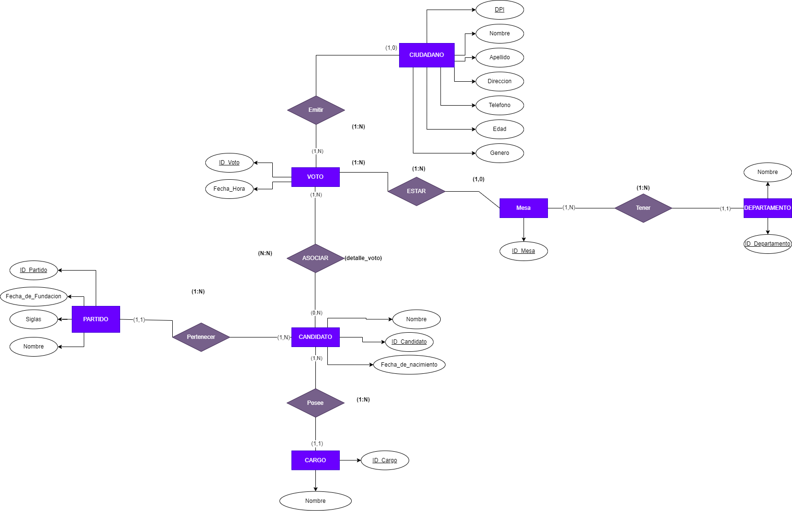
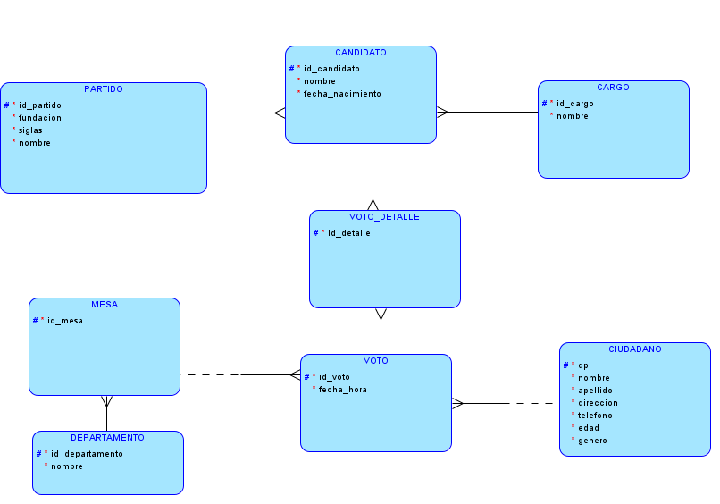
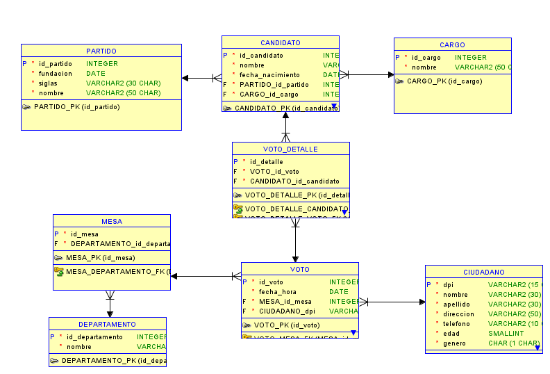

# Documentación
## Descripción general
El Tribunal Supremo Electoral (TSE) tiene la responsabilidad crucial de recopilar los
resultados de las elecciones de diversas mesas distribuidas en todo el territorio nacional. En
este contexto, se requiere la implementación de  un sistema de bases de datos
capaz de realizar consultas que permitan verificar la coherencia entre los reportes manuales
y los generados por el sistema de bases de datos.
___

## Modelado

+ ### Modelo conceptual

___
+ ### Modelo lógico

___
+ ### Diagrama Entidad-Relación

#### Diseño:
Dada la información proporcianda en archivos de tipo .csv se necesitaba crear un modelo que reduciera al mínimo posible la redundancia, de otra manera se producen anomalías en la base de datos. Se consideró el modelo de arriba como solución a este problema. 

A partir de este análisis se determinaron las siguientes entidades:

#### Entidades:
  + Departamento
  + Mesa
  + Voto
  + VotoDetalle
  + Ciudadano
  + Partido
  + Candidato
  + Cargo   

#### Relaciones:
  + __*Mesa*__   debe estar asociado a un __*departamento*__ y un __*departamento*__  puede tener muchas __*Mesas*__

  + __*Mesa*__ puede tener muchos uno o muchos __*votos*__ y un __*voto*__ debe estar en una __*mesa*__.

  + Un __*ciudadano*__ puede emitir uno o muchos __*votos*__ y un __*voto*__ debe ser emitido por un __*ciudadano*__.

  + __*Partido*__ puede tener uno o muchos __*candidatos*__ y un __*candidato*__ debe estar asociado a un __*partido*__

  + __*Candidato*__ debe estar asignado a un solo __*cargp*__ y un __*cargo*__ puede estar asociado a muchos __*candidatos*__  
## API
La API fue construida en Express.js dada su popularidad para Node.js. Además, se utilizaron las siguientes dependencias: 
 + mysql2 para la conexión con el servidor Mysql.

 + fast-csv para el parseo de archivos .csv

### Endpoints:

+ #### /crearmodelo: 
    Crea tablas del modelo

+ #### /cargartabtemp: 
    Carga masiva de datos a tabla temporal

+ #### /eliminarmodelo: 
    Elimina las tablas del modelo de datos de la base de datos.
+ #### /consulta1: 
    MUestra el nombre de los candidatos a presidentes y vicepresidentes por partido

+ #### /consulta2: 
   Muestra el número de candidatos a diputados por partido.

+ #### /consulta3: 
    Muestra el nombre de los candidatos a alcalde por partido
+ #### /consulta4: 
    Muestra la cantidad de candidatos por partido (presidentes, vicepresidentes, diputados,
    alcaldes).
+ #### /consulta5: 
    Cantidad de votos por departamentos.

+ #### /consulta6:
    Cantidad de votos nulos.
+ #### /consulta7: 
    Muestra el  top 10 de edad de ciudadanos que realizaron su voto.

+ #### /consulta8: 
    Muestra el top 10 de candidatos más votados para presidente y vicepresidente
+ #### /consulta9:
    Muestra el top 5 de mesas más frecuentadas
+ #### /consulta10: 
    Muestra el top 5 de las horas más concurridas en que los ciudadanos fueron a votar
+ #### /consulta11: 
    Muestra la cantidad de votos por género (Masculino, Femenino).
